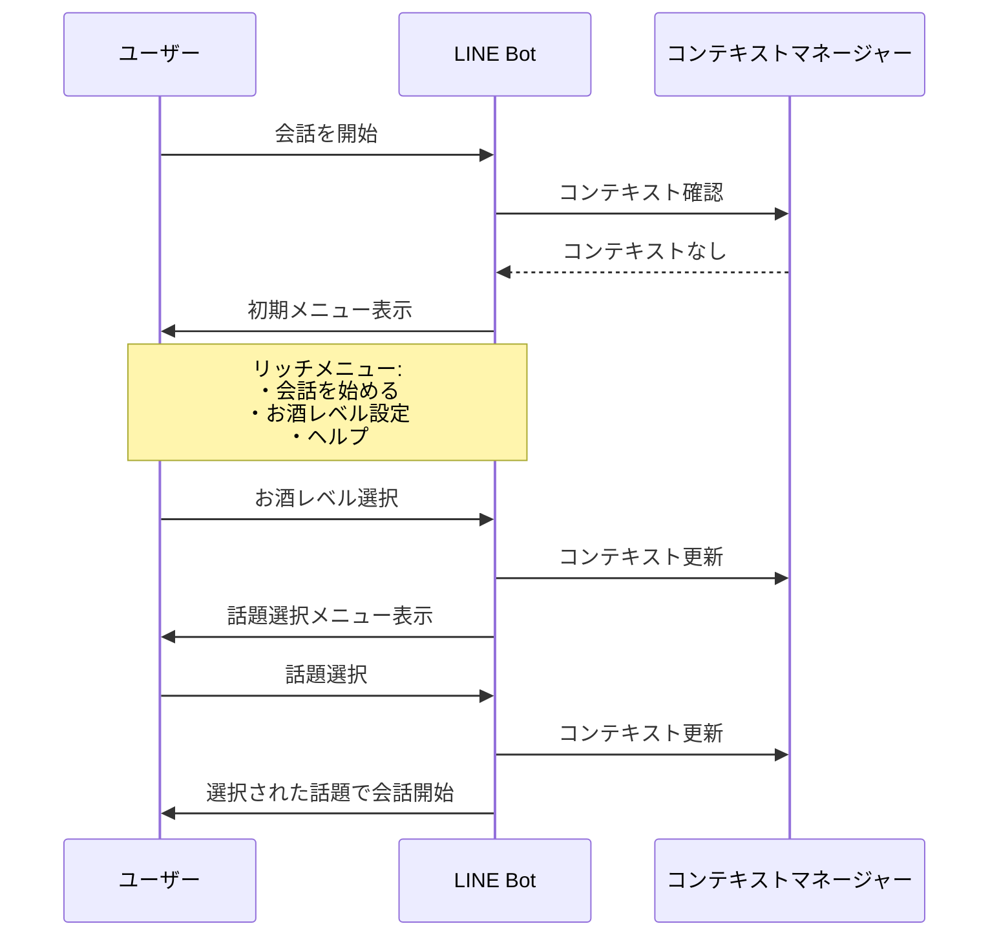
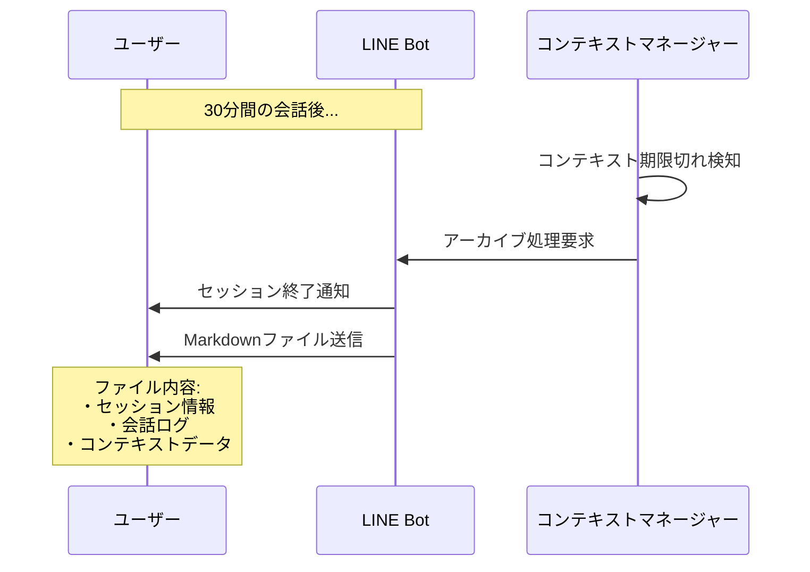
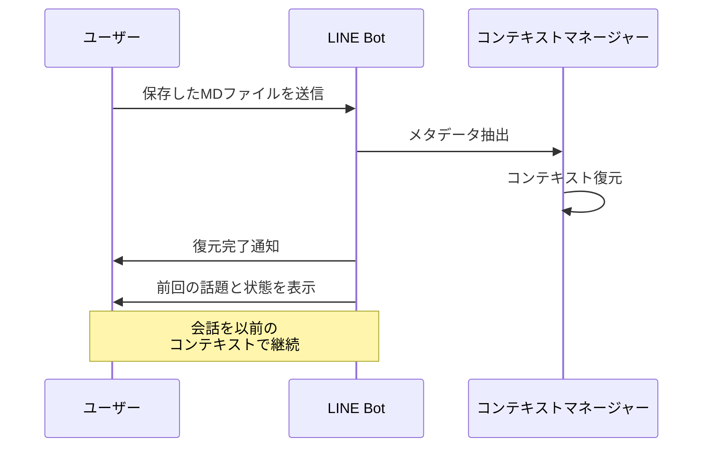
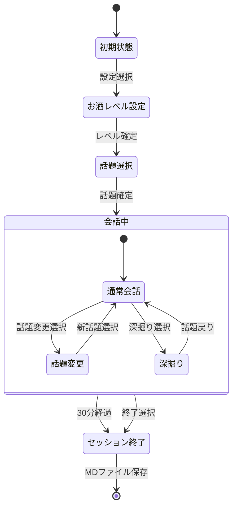
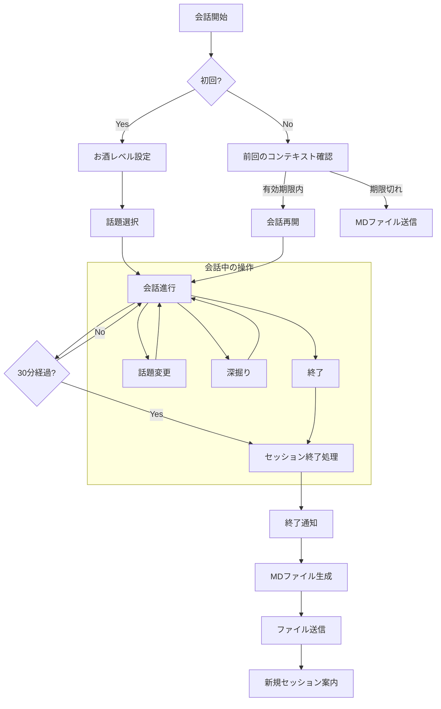
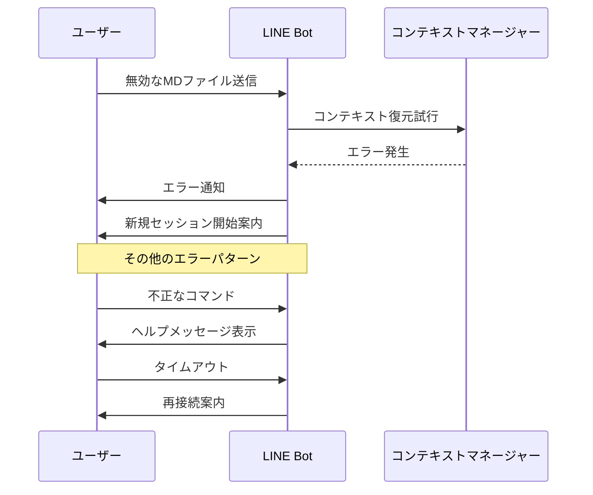
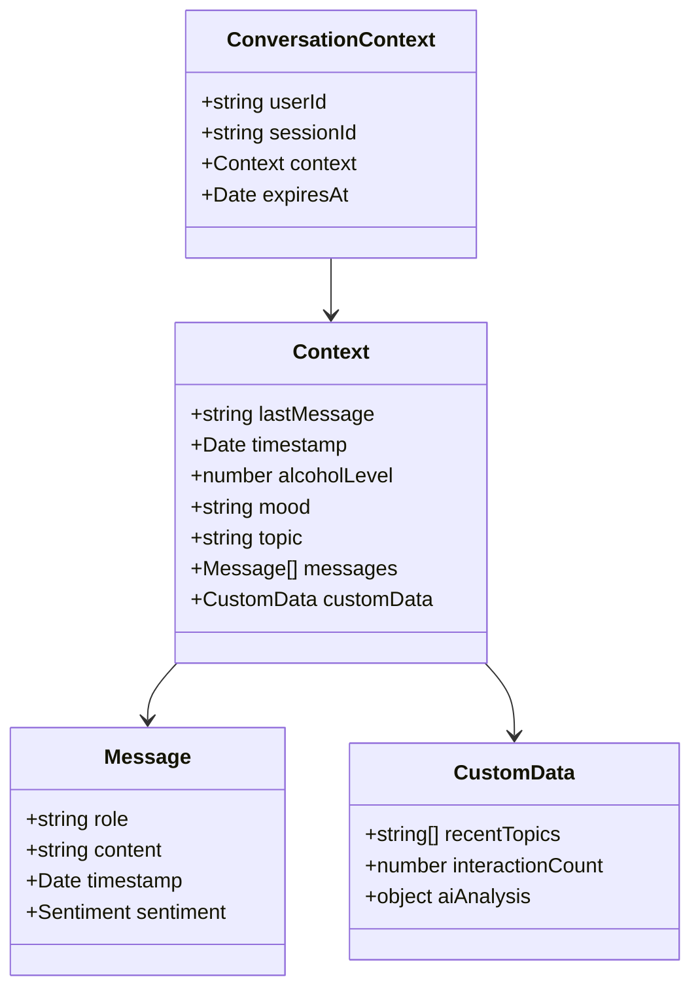

# ユーザー体験フロー

## 1. 基本的な会話フロー



## 2. コンテキスト期限切れと保存



## 3. コンテキスト復元フロー



## 4. 状態遷移図



## 5. ユーザーインタラクション詳細



## 6. エラーハンドリングフロー



## 主要な状態とトリガー

1. **初期状態**
   - トリガー: ボットとの初回対話
   - 表示: 初期リッチメニュー
   - オプション: お酒レベル設定、ヘルプ

2. **お酒レベル設定状態**
   - トリガー: レベル設定選択
   - 表示: お酒レベル選択ボタン
   - オプション: 3段階のレベル

3. **話題選択状態**
   - トリガー: お酒レベル確定
   - 表示: 話題選択メニュー
   - オプション: 仕事、趣味、恋愛など

4. **会話進行状態**
   - トリガー: 話題確定
   - 表示: 会話用リッチメニュー
   - オプション: 深掘り、話題変更、終了

5. **セッション終了状態**
   - トリガー: 30分経過または終了選択
   - 表示: 終了通知とファイル
   - オプション: 新規セッション開始、ファイル保存

## ユーザー体験のポイント

1. **シームレスな状態遷移**
   - 直感的なメニュー操作
   - コンテキストに応じた適切な選択肢
   - スムーズな話題の展開

2. **コンテキスト管理の透明性**
   - セッション終了の明確な通知
   - 会話履歴の可視化
   - 簡単なコンテキスト復元

3. **エラー時の親切な誘導**
   - 明確なエラーメッセージ
   - 復旧手順の提示
   - 代替オプションの提案

## コンテキストの詳細構造



### コンテキストに含まれる情報

1. **基本情報**
   - ユーザーID
   - セッションID
   - 有効期限

2. **会話履歴**
   - 全ての会話メッセージ
   - 各メッセージの送信時刻
   - 発言者（ユーザー/ボット）
   - 感情分析結果

3. **状態情報**
   - 現在のお酒レベル
   - ユーザーの気分
   - 現在の話題
   - 最後のメッセージ

4. **分析データ**
   - 話題の変遷履歴
   - インタラクション回数
   - AIによる会話分析結果

### コンテキストの保存例（MDファイル）

```markdown
# 会話セッション記録
<!-- セッション復元用メタデータ -->
<!--
session_metadata:
  sessionId: "session_20240224_123456"
  startTime: "2024-02-24T12:34:56Z"
  endTime: "2024-02-24T13:04:56Z"
  context:
    alcoholLevel: 2
    mood: "楽しい"
    topic: "仕事"
    messages:
      - role: "user"
        content: "今日は大変な一日だった"
        timestamp: "2024-02-24T12:34:56Z"
        sentiment: "negative"
      - role: "bot"
        content: "お疲れ様でした。仕事で何かありましたか？"
        timestamp: "2024-02-24T12:34:57Z"
      - role: "user"
        content: "プロジェクトの締め切りが厳しくて..."
        timestamp: "2024-02-24T12:35:10Z"
        sentiment: "stressed"
    customData:
      recentTopics: ["仕事", "ストレス", "締め切り"]
      interactionCount: 15
      aiAnalysis:
        userConcerns: ["仕事のプレッシャー", "時間管理"]
        recommendedTopics: ["リラックス方法", "タイムマネジメント"]
-->

## 基本情報
- セッションID: session_20240224_123456
- 開始時刻: 2024-02-24 12:34:56
- 終了時刻: 2024-02-24 13:04:56

## コンテキスト情報
- お酒レベル: 🍺🍺 まあまあ飲んだ
- 気分: 楽しい
- 話題: 仕事

## 会話ログ
### ユーザー (12:34:56)
今日は大変な一日だった

### ボット (12:34:57)
お疲れ様でした。仕事で何かありましたか？

### ユーザー (12:35:10)
プロジェクトの締め切りが厳しくて...

[... 以降の会話ログ ...]
``` 